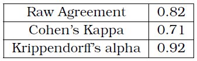

### ethnopharma-set
It's about a classification dataset related to [ethnopharmacology](https://en.wikipedia.org/wiki/Ethnomedicine), related to our [paper](https://www.mdpi.com/2076-3417/11/13/5826) published in MDPI's Applied Sciences with title: "A Personalized-Machine-Learning enabled method for Efficient Research in Ethnopharmacology. The Case of the Southern Balkans and the Coastal Zone of Asia Minor." in 2021.  

In our work, two domain experts set some topics of their interest related to ethnopharmacological research. More specifically, the defined interesting topics regard **ethnopharmacological publications** related to **specific regions** (Southern Balkan countries and Asia Minor) and **plant species** (31 plant families). Therefore, a publication URL can be either relevant to these topics or irrelevant. However, in order to get a better understanding of the problem, our domain experts considered to annotate each URL on a scale from 1 to 4. Thus, we have four different unique labels.  

| Class                | id| desc|
| :------------------: |:-:| :--:|
| *Highly Relevant*    | 1 | Ethnopharmacology in Southern Balkan countries and Asia Minor, related to the 31 defined plant families     |
| *Relevant*           | 2 | Ethnopharmacology in Southern Balkan countries and Asia Minor, but related to the 31 defined plant families |
| *Partially Relevant* | 3 | Ethnopharmacology, but not related to Southern Balkan countries and Asia Minor 				 |
| *Irrelevant*         | 4 | Otherwise                                								         |

The dataset consists of **1012 URLs** with annotations (labels). Each URL is annotated with one of these four labels. ***The classes with id 1,2 and 3 are all related to some ethnopharmacology topic. Thus, one could use this dataset for a general classification task related to ethnopharmacological inference.***

We note that in order to be confident enough about the quality of the annotations given, we measured the agreement levels of our domain experts. We utilized Raw Agreement, Kohen's kappa and Krippendorff's alpha:  

<p align="center">
  
</p>

### Citation

If you find this work helpful in your research, cite:
```
@Article{app11135826,
AUTHOR = {Axiotis, Evangelos and Kontogiannis, Andreas and Kalpoutzakis, Eleftherios and Giannakopoulos, George},
TITLE = {A Personalized Machine-Learning-Enabled Method for Efficient Research in Ethnopharmacology. The Case of the Southern Balkans and the Coastal Zone of Asia Minor},
JOURNAL = {Applied Sciences},
VOLUME = {11},
YEAR = {2021},
NUMBER = {13},
ARTICLE-NUMBER = {5826},
URL = {https://www.mdpi.com/2076-3417/11/13/5826},
ISSN = {2076-3417},
ABSTRACT = {Ethnopharmacology experts face several challenges when identifying and retrieving documents and resources related to their scientific focus. The volume of sources that need to be monitored, the variety of formats utilized, and the different quality of language use across sources present some of what we call “big data” challenges in the analysis of this data. This study aims to understand if and how experts can be supported effectively through intelligent tools in the task of ethnopharmacological literature research. To this end, we utilize a real case study of ethnopharmacology research aimed at the southern Balkans and the coastal zone of Asia Minor. Thus, we propose a methodology for more efficient research in ethnopharmacology. Our work follows an “expert–apprentice” paradigm in an automatic URL extraction process, through crawling, where the apprentice is a machine learning (ML) algorithm, utilizing a combination of active learning (AL) and reinforcement learning (RL), and the expert is the human researcher. ML-powered research improved the effectiveness and efficiency of the domain expert by 3.1 and 5.14 times, respectively, fetching a total number of 420 relevant ethnopharmacological documents in only 7 h versus an estimated 36 h of human-expert effort. Therefore, utilizing artificial intelligence (AI) tools to support the researcher can boost the efficiency and effectiveness of the identification and retrieval of appropriate documents.},
DOI = {10.3390/app11135826}
}
```


